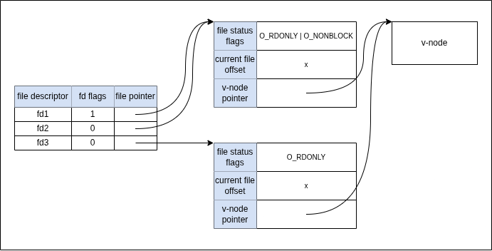

**Q**: Assume that a process executes the following three function calls:
```c
  fd1 = open(path, oflags);
  fd2 = dup(fd1);
  fd3 = open(path, oflags);
```
Draw the resulting picture, similar to Figure 3.9. Which descriptors are
affected by an `fcntl` on `fd1` with a command of `F_SETFD`? Which descriptors are
affected by an `fcntl` on `fd1` with a command of `F_SETFL`?

---

**A**: An `fcntl` call on `fd1` with a command of `F_SETFD` (set file descriptor
flags) only affects `fd1`, and the descriptors `fd1` and `fd2` will be affected
by an `fcntl` call with a command of `F_SETFL` (set file flags).


